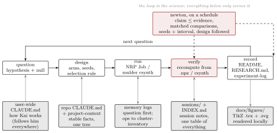

# SYSTEM

How BNJetTag research runs with Claude Code, set 2026-09-26. The shape follows Moreno et al.,
*AI Agents Can Already Autonomously Perform Experimental High Energy Physics*
(arXiv:2603.20179, the JFC framework), adapted from a collider analysis to an ML-on-FPGA
study. Their three parts are kept: a fixed methodology (§1), isolated domain conventions (§2),
and strict agent behaviour with append-only logs (§4). Their sharpest lesson, that agents
ignore instructions buried in a large context, is why `CLAUDE.md` is short and why every rule
that can be a check is a check (§6). This file is the one description of the system.



## 1. The loop, and what happens when you type `/new-experiment`

A campaign is a directory `campaigns/<YYYY-MM-DD>-<type>/` (the type is the kind of job:
training-batch, engram, constituent-screen, confirmation, pt-weighting, synthesis, ops,
engineering). It moves through five phases and each phase leaves exactly one artifact. Context
passes between phases only through these files and the append-only logs; every agent starts
fresh and reads the artifacts it is handed. This is JFC's phase structure with its analysis
phases replaced by ours.

| phase | artifact | owner | contains | JFC counterpart |
| --- | --- | --- | --- | --- |
| 1 design | `STUDY.md` | experiment-designer | question and null, arms, seeds, pre-registered selection rule, falsifier, budget, conventions-compliance table | Strategy → STRATEGY.md |
| 2 preflight | `PREFLIGHT.md` | ml-engineer, cluster-ops | config builds, CPU build/reload gates, `nrp_doctor lint` output, code sha, ConfigMap name | Exploration and the 1000-event prototype |
| 3 run | `RUN.md` | cluster-ops | launch record, jobs, nodes, W&B group, resumes and incidents with pointers into `cluster-inventory.md` | Processing |
| 4 verify | `VERIFY.md` | results-analyst | every number recomputed from `.npz` or csynth JSON with metric, split, n, status; seed spread and an interval on every gap; a verdict per claim | Expected results and the fit diagnostics |
| 5 report | `REPORT.md` | paper-writer | what the study says about the thesis and what is open; figures through the style kit; outward text | Documentation |

**Walkthrough.** `/new-experiment does N64 beat N8 at a fixed eBOP cap` creates
`campaigns/2026-09-27-constituent-screen/`, and experiment-designer writes `STUDY.md`: the
question with its null, the arms, the seeds, the selection rule fixed before any result exists,
the result that would falsify the claim, and a table saying which conventions in §2 the design
satisfies. It stops. You read it. Then ml-engineer and cluster-ops produce `PREFLIGHT.md`: the
configs build on CPU, checkpoints reload within tolerance, the manifest passes lint (the hook
refuses `kubectl apply` otherwise), the code sha and ConfigMap are recorded. cluster-ops
launches under the standing grant and keeps `RUN.md`, and every incident goes to
`cluster-inventory.md` with a Check line. When results land, `/verify-results` has
results-analyst write `VERIFY.md`, recomputing each number from the arrays with its metric,
split, n and status, and putting a seed spread and an interval on every gap. `/rounds` has
critical-reviewer read the artifacts and return a verdict. On PASS, paper-writer writes `REPORT.md` and
runs the style kit and the validators. Then the one moment that is yours: you decide whether a
number from `VERIFY.md` enters the record (`README`, `RESEARCH.md`, a PI update) or goes
outward. That is JFC's unblinding gate, moved to where our risk is.

**Review (`/review <id> <PHASE>`).** JFC's panel, adopted on 2026-09-26 and patched back to
upstream the same evening (the first port had dropped mandatory blocks). Validators run
first (`nrp_doctor lint`, `tools/verify_check.py`, `tools/prose_lint.py`, `tools/pdf_check.py`,
`tools/bib_check.py`; an A-grade line is a red flag nobody may downgrade), and at VERIFY and
REPORT the **plot-validator** runs `tools/plot_check.py` and then opens every figure. Then three fresh-context reviewers in parallel: the **physics-reviewer**, who is
given only the thesis and the artifact and never our rules; the **critical-reviewer**
(JFC's, ported whole), with the methodology, the conventions and the log, checking conventions row by
row, commitments, numerical self-consistency, and recomputing a headline; and the
**constructive-reviewer**, who strengthens without being lenient. The **arbiter** reads all
of it, resolves disagreements against the artifact, and returns `PASS`, `ITERATE` (the **fixer**
resolves each finding with minimum change and propagates every changed number, then re-review) or `ESCALATE` (needs you). Regression triggers
(a selection rule on the wrong split, a changed schedule, a broken binarization, a screen
compared to the record; the list is `docs/methodology/06-review.md` §6.7) spawn the
**investigator**, whose ticket scopes what re-runs; you see it, then the fixer executes it. `/rounds` is critical-reviewer alone over an
interval; `/redteam <claim>` is critical-reviewer attacking one claim before it goes outward.

**The log.** Experiment-log entries are question-first, newest on top, and record failed
approaches with their mechanism so nobody retries them (JFC's stated purpose for the log):

```
## 2026-09-24 — Does N64 beat N8 at a fixed eBOP cap?  (campaigns/2026-09-24-confirmation)
Question:        one line, with the null.
Design:          arms, seeds, selection rule, what would falsify the claim.
Result:          numbers with metric, split, n, status; or "no result yet".
Interpretation:  what it means for the thesis; what is still open.
Ops:             RUN.md; incidents → cluster-inventory.md 2026-09-24.
```

Decisions with rationale go to `decisions.md`; literature findings with date and URL to
`research-log.md`; cluster incidents to `cluster-inventory.md`, each ending with a **Check**
line (the mechanical check that now catches it, or `prose only`).

## 2. Conventions (JFC Table 1, ours)

| task | required | not allowed |
| --- | --- | --- |
| recompute a number | `uv run --with numpy,scikit-learn python` over the `.npz` / csynth JSON | quoting from memory, from a README, or from W&B alone |
| label a number | metric + split + n + status (single seed / seed-averaged) | validation AUC beside ROC-test AUC unlabelled; cross-N or cross-input comparisons |
| state a gap | seeds and an interval (results-analyst) | a difference inside the seed spread called a trend |
| figures | matplotlib + `docs/style/bnjettag.mplstyle`; `.png` and `.svg`; provenance caption; `tools/plot_check.py` clean | plotly, seaborn, titles on axes, hard-coded font sizes |
| ROC axes | efficiency on x, mistag rate on log y | linear mistag axis |
| schematics | TikZ in `docs/figures/<name>.tex`, `docs/figures/render.sh` | mermaid for print; the upmath MCP for anything beyond an equation |
| documents, PDFs | LaTeX with `docs/style/bnjettag.sty`, tectonic | LLM-converted PDFs |
| prose that ships | `tools/prose_lint.py` and the `human-repo` sweep | promotional framing, addressee lines, assistant traces |
| training environment | pins copied from the current job YAML | a drifted local venv used for anything quotable |
| launching | `kubectl apply` of a manifest that passed `nrp_doctor lint` (the hook enforces it) | manifests on stdin, unlinted YAML |
| GPU jobs | `bnjettag.io/arms-per-pod` declared; choose product and K by the [GPU selection policy](docs/infrastructure/gpu-selection-policy.md), with measured throughput and the 40% utilization floor | an unbenchmarked product or one small arm alone without `single-arm-justified` |
| scratch compute | the lab pod or the local kernel, W&B offline | quoting anything computed there |
| literature | `literature/INDEX.md` is the entry point; open one note | globbing the notes folder into context |
| history | `_attic/` and `archive/` are frozen; the index lists them | quoting, comparing against, or folding them back without being asked |
| secrets | the W&B key stays at `bnjettag/wandb-api-key.txt`, gitignored | printing, pasting, or committing a key |

## 3. One workspace

Decided 2026-09-26: everything lives in one folder, `~/lab/bnjettag/`, which is the science
repo (its git history intact) with the harness folded in. `tools/migrate.sh plan` prints the
move; `tools/migrate.sh run` does it (moves only, nothing deleted; see §7).

```
~/lab/bnjettag/
  SYSTEM.md  CLAUDE.md  INDEX.md  README.md  RESEARCH.md  DATASET.md
  campaigns/      one directory per campaign, <date>-<type>/, the five artifacts inside
  bnjettag/       code (the research line), results/, roc-results/, models/   [pipeline, tracked]
  publication/    the GitHub working copy (kai124138/BinaryTransfomerJettager): code, results, figures, README
  published/      bnjettag_results, bnjettag-code, bnjettag-methodology (the three public repos)
  literature/     55 annotated papers; INDEX.md is the entry point
  messages/       everything written for people: PI updates, posters, speaker notes, Slack drafts, all dated
  docs/           infrastructure/, style/ (the kit), figures/ (schematics)
  nrp-lab/        the GPU pod and nrp_doctor.py;  local/  the laptop kernel
  tools/          the checks and the index;  .claude/  agents, commands, skills, hooks, memory
  sessions/       one note per Claude session (gitignored)
  data/  _attic/  reference-code/   unchanged, frozen
  archive/        2026-09-26-integration/: the old agent layer, the clone copies, the lab repo's git history
(historical July/September snapshots are imported reference snapshots, not part of the working tree)
```

Nothing is archived by moving it out of the index. A superseded campaign gets
`status: superseded` and `superseded_by:` in its header and stays where it is.

**Two code lines, on purpose.** `bnjettag/code/hgq2` (pT weighting, the 24-run eval) and
`publication/code/hgq2` (Engram, the constituent study, the post-conference configs) diverged
after 2026-09-08 in 135 files. They are not merged by hand: `campaigns/2026-09-26-code-line-merge/`
is the study that does it, with the build and reload gates in its `STUDY.md`.

## 4. Agents and commands

Six of the 13 agent files are stage owners, each spawned fresh with only its brief (JFC's
disposable-context rule). Cheap models find, expensive models judge.

| agent | model | owns | absorbed on 2026-09-26 |
| --- | --- | --- | --- |
| experiment-designer | opus | STUDY.md | |
| ml-engineer | opus | code, configs, PREFLIGHT.md | upstream-diff |
| cluster-ops | sonnet | PREFLIGHT.md, RUN.md, incidents | |
| results-analyst | opus | VERIFY.md, intervals | uncertainty-analyst |
| physics-researcher | sonnet | physics questions, literature, dossiers, sweeps | paper-miner, arxiv-scout |
| paper-writer | opus | REPORT.md, outward text, figures, repos | repo-artisan, figure-smith |

The review panel and its two helpers, added from JFC (fresh-context; reviewers, plot-validator and arbiter run on opus; per the frontmatter, investigator and fixer run on sonnet). The six
owners share JFC's executor protocol (plan.md first, self-check, anti-fabrication, formula
verification, flagged decisions), written once in `docs/methodology/03-phases.md`:

| agent | sees | writes |
| --- | --- | --- |
| physics-reviewer | the thesis paragraph and the artifact, nothing else | `review/<PHASE>_physics_v<n>.md` |
| critical-reviewer | methodology, conventions, log, validator output, artifact | `review/<PHASE>_critical_v<n>.md` in panel mode; alone at PREFLIGHT, RUN, `/rounds`, `/redteam`, with the verdict, in `.claude/memory/review-reports.md` (absorbed newton, which had absorbed skeptic) |
| constructive-reviewer | methodology, conventions, log, artifact | `review/<PHASE>_constructive_v<n>.md` |
| arbiter | the artifact and every review | `review/<PHASE>_arbiter_v<n>.md` with the verdict |
| investigator | the triggering finding and the campaign | `REGRESSION_TICKET.md`, a line in `regression_log.md` |
| plot-validator | figure scripts, every rendered figure, the arrays behind them | `review/<PHASE>_plots_v<n>.md`; red flags are A |
| fixer | the arbiter file or the ticket, the artifact, the owner's definition | the minimum fix, propagated; RESOLVED / PARTIAL / CANNOT per finding |

Commands: `/status`, `/new-experiment`, `/review`, `/verify-results`, `/rounds`, `/redteam`,
`/diagram`, `/log-decision`, `/pi-update`, `/literature-scan`, `/ops`. The main session is the
orchestrator; there is no lead-pm agent. The retired originals are in `archive/2026-09-26-integration/research-claude/`.
`docs/methodology/` (principles, phases, review protocol, checklists, templates) and
`docs/conventions/` (metrics, quantization and cost, synthesis, figures) are the JFC
"methodology" and "conventions" tiers written for this project.

### Jev in the loop (adopted 2026-10-02, advisory)

Jev (`tools/jev/`, MCP server `jev-lab`, runbook `docs/infrastructure/jev-lab.md`) gives typed
second opinions; it never issues a verdict. Where it sits: `lab_check_protocol` /
`lab_freeze_protocol` and `jev_check_methods` at STUDY and PREFLIGHT (experiment-designer,
ml-engineer); `jev_triage_logs` on failures (cluster-ops, investigator); `jev_check_claims` on
every quoted number (critical-reviewer, results-analyst, paper-writer, fixer);
`jev_triage_review` as the arbiter's second opinion on finding categories; `jev_screen_papers`
and `jev_rank_snippets` for literature. Each agent definition in `.claude/agents/` names its
tools. Health: `python3 tools/jev_lab.py doctor`.

## 5. Selection instead of instruction

Anything with taste in it (figure style, diagram layout, README shape, wording, palette)
arrives as two or three variants on one contact sheet; you answer with a letter. The pick is
promoted into the style kit, logged in `docs/style/CHOICES.md`, and never asked again. First
sheet: `docs/figures/style/contact-sheet-auc.png`, pick B (journal), 2026-09-26.

## 6. Checks that replaced prose

- `.claude/hooks/pre-kubectl-lint.py` blocks `kubectl apply|create|replace -f` on a lint ERROR
  (tested: bad manifest exit 2, warnings pass with the text shown, other commands untouched).
- `nrp-lab/nrp_doctor.py lint` rule PACK: the 40 % GPU floor as a manifest check.
- `tools/plot_check.py`, `tools/prose_lint.py`, `tools/claims.py`: figure, prose and number
  hygiene; A-grade findings block.
- `tools/index.py`: one table, context budget under 150 lines. `tools/brief.py`: the session
  start. `tools/merge_logs.py`: merging the two memory-log copies without dropping an entry.

## 7. Pending decisions

Kept as bullets so the index and the session brief surface them until they are made.

- Push gate (critical-reviewer rounds 2026-09-26): two outward fixes are committed locally as you and not pushed. `~/Desktop/bnjettag_results` ff4c3a0 (figure axes now name the split; §4.5 says the sextile analysis was post hoc) → `git push origin main`. `publication-engram-20260921` a067d9c on branch `publish/final-training-20260923` (exploratory stated as exploratory; cross-axis N8→N64 labelled; Engram control collapse recorded) → push to `origin/main`. Read the diffs first: `git show HEAD` in each.
- Is `kai124138/bnjettag_results` private or public? The 2026-09-26 log says private, `project-context.md` says public. One word from you settles it.
- User-wide `~/.claude/CLAUDE.md`: `docs/proposed-user-CLAUDE.md` is ready to copy; one marked line would let kubectl and mulder run unasked in every folder on this machine, not only here. Yes, narrow, or delete.
- Palette: the checker flags the FP32 near-black as reading grey and the W1A4 pink as low contrast; a three-palette contact sheet is available on request.

## 8. Tokens

Good spend: parallel variants for a sheet, recomputes, red-team passes, fresh-context
subagents that read so the main thread does not. Bad spend: re-orientation (the brief removes
it), re-reading ten-thousand-line logs (the index replaces it), an expensive model doing a lookup.

## 9. What changed on 2026-09-26, and why

Found: preferences lived under another project directory and never loaded here; session
notes had stopped on 2026-09-10; newton had not run since 2026-08-01; eleven files called a
`lab` CLI that does not exist here; two user-wide skill symlinks were broken; ten bnjettag
folders across Desktop, Downloads and home, five of them copies of the pipeline code; two
near-identical agent layers of sixteen and fifteen; an experiment log that recorded pod
utilisation instead of questions; a diagram loop that failed on every real figure.

Done: symlinks repaired; local TikZ rendering; style kit with the journal pick and a compiled
test report; rule PACK and the launch hook; the index with campaign stubs marked `unreviewed`
(two live ones filled from the log: pT weighting, and the code-line merge as a study);
the session brief; session notes redirected and twenty backfilled; the validators; every
cluster-inventory entry given a Check line; agents merged sixteen to seven, commands sixteen
to ten (13 agent files and one command, `/review`, recreated 2026-10-04 per `decisions.md`, exist now); both memory sets consolidated into this project's memory; the migration written as a
script; this file.
