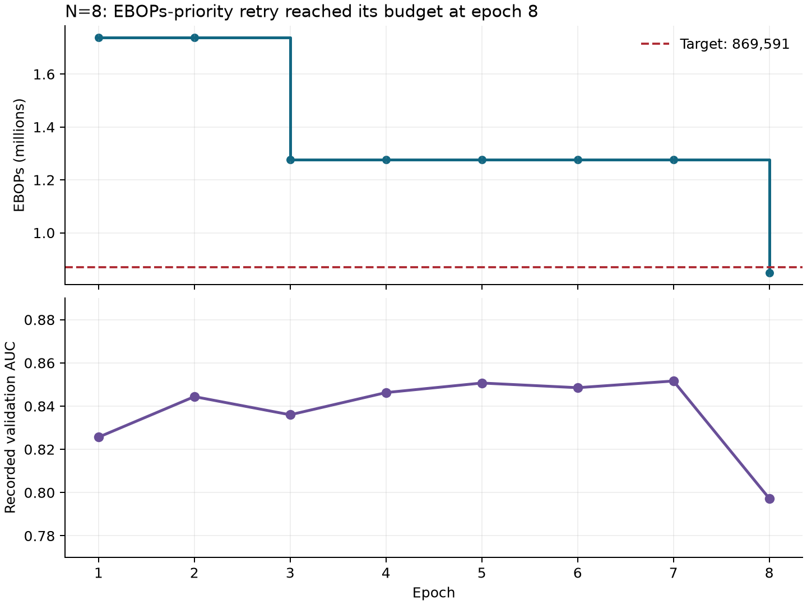

# N8 EBOPs-priority retry: target met

Run [8dzauzyp](https://wandb.ai/kayamaguchi-uc-san-diego/BNJetTag-EBOPs-N8/runs/8dzauzyp) finished with a committed model artifact.
The saved `model_best.keras` measures **847,982 EBOPs**, below the
**869,591** ceiling by **2.48%**.
That is **51.24% below initialization** and
**52.38% below the earlier control checkpoint**.
Training stopped after **8 epochs**, 8.85 minutes
of training (the cluster Job includes additional setup/download time).

| Saved checkpoint | EBOPs | Recorded validation macro-OvR AUC |
|---|---:|---:|
| Earlier control | 1,780,910 | 0.87166 |
| Earlier 75% budget | 1,263,790 | 0.87005 |
| New EBOPs-priority 50% retry | 847,982 | 0.79728 |

All are single-seed N8/L1x3 runs. AUCs are **quoted from the corresponding model
artifact's `train_meta.json`**, not recomputed from predictions here. New source:
[train_meta.json](8dzauzyp/artifact/train_meta.json); earlier sources:
[control](../../ebops-n8-20260910/analysis/ed3piak8/artifact/train_meta.json) and
[75%](../../ebops-n8-20260910/analysis/3bynw2ra/artifact/train_meta.json).
These use the 124,000-jet internal validation split, not the held-out ROC-test split.
No seed uncertainty or statistical significance is established.

## What changed during training

- Epochs 1–2: 1,739,182 EBOPs, average activation width 8 bits.
- Epochs 3–7: 1,276,686 EBOPs, average width about 6.05 bits.
- Epoch 8: 847,982 EBOPs, average width about 4.14 bits; target passed, automatic stop.
- All 21 learnable sites changed: 19 ended at 4 bits, one at 5, one at 6.
  The two explicitly fixed attention probability input sites remain fixed.
- Beta started at 1e-4, briefly reached about 1.0718e-4, then stayed at its 1e-4 floor.
  It never approached the configured 1e-2 maximum. The much stronger initial
  pressure plus constant 1e-4 learning rate was sufficient for this target.
- The preceding epoch recorded validation AUC 0.85162 at 1,276,686 EBOPs; the last
  width reduction coincided with the drop to 0.79728. This does not prove that
  0.79728 is the best achievable AUC at the final widths: there was no recovery
  training after crossing the budget. Beta, LR, schedule, and checkpoint selection
  all changed, so this is not an isolated measurement of beta's effect.

## Verification and interpretation

Reloaded the committed checkpoint in a fresh process; zero-input and random-input
HGQ2 cost measurements both equal **847,982**, and every activation-width record
matches the artifact. All **15 binary layers** retain exactly two nonzero,
symmetric effective weight values. See [verification](checkpoint_verification.json).
The source hash matches the launched immutable code snapshot; `jit_compile=false`
and the budget-based stopping rule are recorded in the artifact metadata.

This run demonstrates sub-million EBOPs within the existing architecture, with
lower recorded validation AUC. It stopped at the requested budget; it does not
establish the lowest achievable EBOPs. EBOPs remain a hardware-cost proxy; no new
MAC count reduction or synthesized LUT result is established. A possible next
experiment is to freeze these widths and fine-tune weights while checking that
EBOPs remains under the cap; accuracy recovery is a hypothesis, not a guarantee.
No additional training jobs were launched during this analysis.

