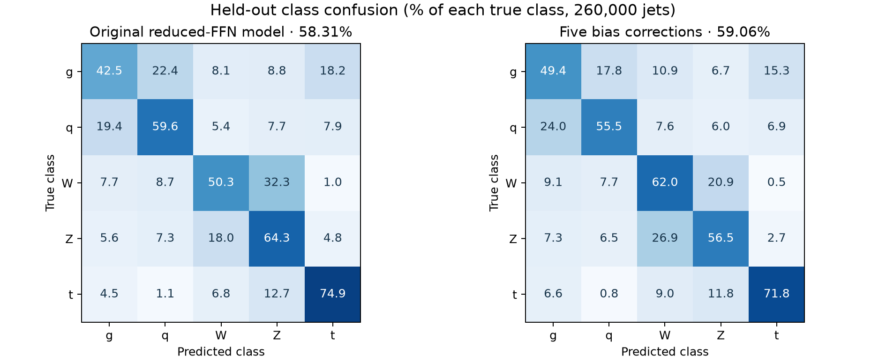

# Accuracy investigation — 16 September 2026 (PDT)

Full theory, algorithms, annotated code snippets, experiment tables, and reproduction details: [Frozen-backbone methods](FROZEN_BACKBONE_METHODS.md).

**Best new tested model: 59.1396% held-out accuracy, 0.855957 held-out macro AUC, 322,510 native EBOPs.** Refit only the final 160 weights of the original channel model and quantize them to 8 bits; the 14 earlier weight layers remain binary. Against the original channel checkpoint, accuracy gains **0.3965 percentage points (paired 95% CI 0.3191–0.4740)** for **1.45% more EBOPs**, still below 350k. [Saved experimental model](head-features/selected_model.keras) · [input standardization](head-features/input_std.json) · [model metadata](head-features/selected_model_metadata.json) · [head experiment details](head-features/README.md).

Fresh CPU batch evaluation of seven immutable checkpoint snapshots on Nautilus. The strongest original model is channel-wise quantization: **58.7431% held-out top-1 accuracy, 0.850795 held-out macro one-vs-rest AUC, 317,890 EBOPs**. Both metrics below use the same 260,000 events. The older 0.851884 channel AUC was an internal-validation selection metric on 124,000 different events.

## Current checkpoints: accuracy first

| Model | Held-out accuracy | Held-out macro AUC | Native model EBOPs | Validation-selected output correction: held-out accuracy |
|---|---:|---:|---:|---:|
| Tensor-wise | 57.4758% | 0.844527 | 348,526 | 57.7958% |
| Channel-wise | 58.7431% | 0.850795 | 317,890 | 58.7069% |
| Reduced feed-forward | 58.3131% | 0.853526 | 329,838 | 59.0512% |
| 8-bit attention | 57.3435% | 0.845380 | 340,174 | 58.0469% |
| Gradual budget | 57.5085% | 0.846941 | 349,550 | 57.7938% |
| Fixed-width recovery | 56.9404% | 0.840727 | 349,390 | 57.2565% |
| Distillation (interim) | 56.9123% | 0.841338 | 348,366 | 56.9958% |

Correction column uses the prespecified float64 reference; the deployable float32/rounded candidate is described below. R3 and R4 are now completed; the previous report omitted R4 because it had no feasible checkpoint at that time. R6 remains an interim snapshot from committed epoch generation 898, selected epoch 183 (zero-based).

## Why accuracy is lower than AUC

1. **Different quantities.** Top-1 accuracy requires the true class to beat all four rivals on an event. Each OvR AUC ranks one class against all other events, and macro AUC averages five such rankings. There is no conversion from 0.85 AUC to 85% five-class accuracy. Synthetic tests demonstrate AUC=1.0 with 20% categorical accuracy. [Metric definitions](https://scikit-learn.org/stable/auto_examples/model_selection/plot_roc.html).
2. **Real class confusion and limited inputs.** All 60 archived fixed-precision AUCs were independently reproduced; labels, normalization, class ordering and argmax checks passed. Eight-constituent W1A8 averages 62.236% accuracy with 0.87122 AUC over three seeds. Even FP32 averages only 64.628% with 0.88643 AUC. In the binary seed-1 model, g/q and W/Z mutual confusion accounts for 40.35% of errors. The related [Ultrafast jet classification paper, Table 1](https://arxiv.org/html/2402.01876v2) reports 64.6% eight-particle MLP accuracy alongside class AUCs of 0.84–0.92; different preprocessing/splits prevent direct model ranking.
3. **Reporting and selection mismatch.** The ablation loop logged training accuracy beside validation AUC, and selected feasible checkpoints by validation AUC only. Published held-out accuracy itself was computed correctly. Reduced FFN had higher validation AUC than channel-wise quantization, but lower original categorical accuracy. The two objectives select different models.
4. **Compression and constituent limits.** Binary weights and a strong 350k cost ceiling restrict capacity. Archived n16 W1A8 improves over n8 by 5.284 percentage points (three-seed paired t 95% CI 4.586–5.983), but recorded fixed-precision cost increases from 1,739,182 to 4,819,784 EBOPs, about 2.77×. That is not a drop-in solution under the current budget. n32/n64 binary runs also exhibit large seed instability.

## Tested low-cost solution

**Use the reduced-feed-forward checkpoint with five class-specific logit offsets.** The correction was fitted on 61,999 internal-validation events, selected on the other 62,001, then evaluated on held-out predictions. Identity, bias-only, vector scaling, and accuracy-oriented bias sweeps were prespecified candidates. Scalar temperature scaling preserves argmax and cannot improve top-1 accuracy; [Guo et al., section 4.2](https://proceedings.mlr.press/v70/guo17a/guo17a.pdf) explains this distinction.

The float64 correction raises this model from **58.3131% to 59.0512%**. Validation then selected 10 fractional-bit constants using explicit float32 arithmetic: **59.0600%** held-out accuracy. The rounded result improves on its own uncorrected model by **0.7469 percentage points**, paired event-level 95% CI **0.6424–0.8514**; versus the previous-best channel model, the gain is **0.3169 points**, CI **0.1629–0.4709**. These are conditional single-seed event intervals, not estimates of training-seed robustness.

Class order is g, q, W, Z, t. Add `[0.3115234375, 0.0908203125, 0.322265625, 0.0, -0.255859375]` to the five logits before argmax. Scales are all one. [Selected parameters](results/selected_correction.json) identify the exact source checkpoint SHA-256; [apply_correction.py](apply_correction.py) checks that identifier and uses the tested arithmetic.

This requires five additions per event (one is zero); it can potentially be folded into the existing final bias. Native backbone EBOPs remain 329,838, but the standalone correction and any exported bias-folding need hardware verification before claiming a combined FPGA budget or unchanged hardware latency. Float32 and 8/10/12/16 fractional-bit constants were checked; these tests do not simulate FPGA accumulators, saturation or fused operations.

Overall accuracy improves through a class tradeoff: g and W recall rise while q, Z and t recall fall. Do not adopt this decision rule if those per-class operating points are unacceptable. The channel model did not improve with its validation-selected correction, which is retained in the evidence rather than suppressed.



## Frozen final-classifier refit

This addresses a demonstrated, modest final-layer bottleneck while retaining the existing backbone. Extracted quantized head inputs reconstruct the original model, with train/validation cache and source-index checks. The linear classifier was fitted on a fixed 100,000-event subset of training data; two ridge strengths and 4/8-bit final weights were prespecified, and candidate selection used internal validation accuracy and a native 350k EBOP gate. The weaker regularizer did not converge within 150 iterations and was excluded. The 4-bit candidate lost validation accuracy. The selected 8-bit head converged in 51 iterations and achieved 59.3871% validation accuracy.

The saved model was reloaded; its prediction equality and native 322,510 EBOP measurement passed. Independent local verification of the held-out prediction archive reproduces 59.1396% accuracy, 0.855957 macro AUC, and the paired improvement. Only 160 weights change precision, with the same 32×5 final matrix dimensions; this adds 4,620 EBOPs. This is a **mixed-precision** model and is not compatible with describing every weight layer as binary. Higher precision in the final layer may affect FPGA resources and latency; those remain unmeasured.

The new head is 0.0796 percentage points above the rounded-bias alternative, but the paired 95% interval is −0.0719 to +0.2312 points. These data do not establish it as more accurate than that alternative. Its verified native model cost is lower, and its improvement over its own original channel checkpoint is clear at the conditional event level. Use the bias alternative if all learned weight layers must remain binary; confirm both across seeds before deployment.

Feature extraction took 264 seconds. A missing SciPy dependency was fixed in a second isolated Job reusing the frozen feature cache; fitting/evaluation took 25.39 seconds and the complete retry 80 seconds. No repeated backbone inference or GPU training was needed. Both Jobs and their temporary ConfigMap were removed after retrieval. The corrected one-shot manifest, actual submitted-job records, model, and predictions are retained.

## Implemented training fix

[publication ablation.py](../../publication/code/hgq2/bnhgq2/ablation.py) now logs `train_categorical_accuracy` and `val_categorical_accuracy`, using the existing validation logits without an additional inference pass. New experiments can set `experiment.selection_metric = "val_categorical_accuracy"`; ties use AUC, lower cost, then earlier epoch. Default AUC selection and digest-based resume protection remain intact. Use a new experiment config/output root; do not hot-patch an active historical run. No real-data accuracy improvement is attributed to this code change until new training is performed.

The code passed six focused regression tests and a real pinned TensorFlow/HGQ2 cluster integration: accuracy selection, default AUC selection, and infeasible-budget fallback, each with two synthetic epochs, interruption/resume, incorrect-objective rejection, checkpoint reload and metric equality. The repository validator also passed all 50 Python sources and 36 configurations.

## Compute, verification, and limitations

- Three agents independently audited predictions, code/research, and infrastructure. Local numerical work used bounded CPU processes; no full local neural-network training was run.
- Main NRP evaluation: one 4-CPU/8-GiB Job, 761 seconds elapsed, 30-minute hard cap, no GPU. Each 260k test inference took about 33–35 seconds. These are batch CPU throughput measurements, not single-event or FPGA latency.
- Selection integration: successful 2-CPU/8-GiB Job, 204 seconds; one short failed dependency setup was retained in the logs. Temporary evaluation and integration Jobs/ConfigMaps were removed after artifacts were collected. Ongoing training was not modified.
- Mulder independently verified metric counterexamples and arithmetic in 12 seconds with one CPU thread and existing packages. Warm NumPy 4096-event batches measured about 0.0093 microseconds/event for bias additions and 0.0183 for scaling plus bias, excluding model inference and argmax. No FPGA synthesis was launched for this arithmetic-only diagnosis.
- All seven model/prediction hashes match copied artifacts, held-out labels match archived Round-14 labels, and native checkpoint EBOPs were remeasured. All 14 fresh validation/test AUCs agree with an independent sklearn implementation within 1e-12. Six previously reported test accuracies reproduce exactly.
- Fresh CPU validation AUC differs from historical selection AUC by at most 8.245e-5 (channel model). The source and fresh values remain separate. Inspected SAT quantizers provide no evidence that tracing changes learned widths; float32 probability rounding explains only about 2e-8 for channel. CPU/GPU arithmetic or tie effects remain hypotheses. This small unresolved reproducibility difference does not explain the large accuracy–AUC gap.
- Calibration uses validation data already involved in checkpoint selection. Representation tuning adds another validation choice. Confirm the selected rule across fresh seeds and untouched data before treating the gain as established deployment performance.

## Reproduction and evidence

Run from the lab repository root with NumPy, SciPy and scikit-learn available:

```bash
python3 local/accuracy-investigation/prediction-audit/audit.py
OPENBLAS_NUM_THREADS=1 python3 local/accuracy-investigation/calibrate_outputs.py local/accuracy-investigation/remote-results
OPENBLAS_NUM_THREADS=1 python3 local/accuracy-investigation/check_deployment_stability.py local/accuracy-investigation/remote-results
python3 local/accuracy-investigation/verify_new_predictions.py
python3 -m unittest discover -s local/accuracy-investigation -p 'test_*.py'
python3 local/accuracy-investigation/metric-research/test_selection.py
```

`export_diagnostics.py` and `diagnostic-job.yaml` reproduce the cluster export using the documented existing code bundle/PVC. Raw predictions and immutable snapshots remain locally in `remote-results/` (ignored by Git) and remotely under `/data/accuracy-diagnostics-20260917`. Compact evidence is in [results/](results/), the [archived prediction audit](prediction-audit/README.md), [code/research findings](metric-research/findings.md), [integration log](metric-research/integration.log), and [compute inventory](compute-inventory/README.md).
