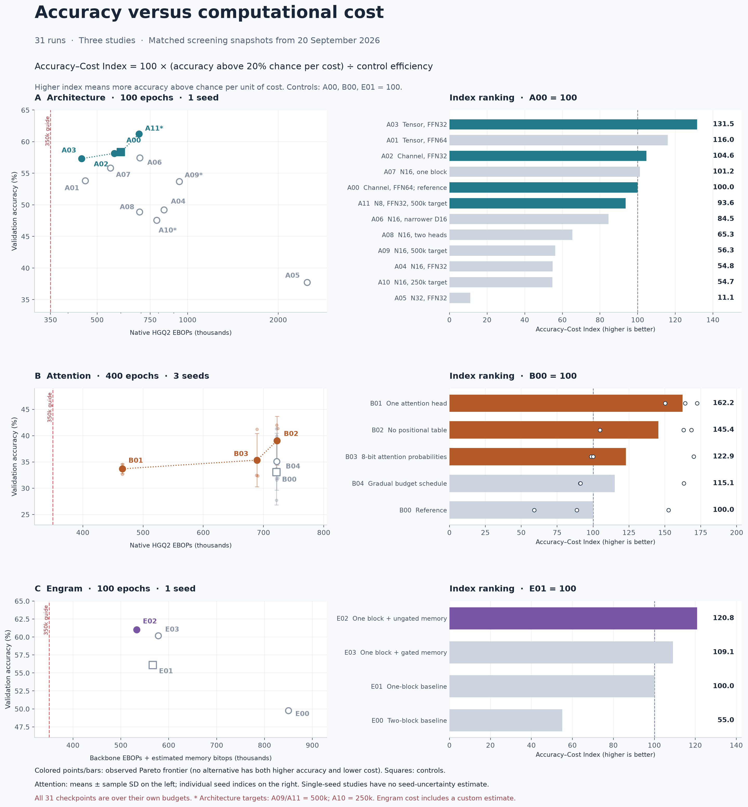

# Accuracy–cost ranking of the current training changes

This report compares all 31 active continuation runs at their completed screening stops: architecture at 100 epochs (seed 1), attention at 400 epochs (seeds 4–6), and Engram at 100 epochs (seed 1). Ongoing resumed epochs are deliberately not mixed into these comparisons. This combined report includes private Engram results and is kept local.

## The index

**Accuracy–Cost Index (ACI)** = `100 × mean[(accuracy − 0.20) / cost] / mean[(control accuracy − 0.20) / control cost]`.

Accuracy is a fraction. Twenty percent is the expected accuracy of uniform random guessing across five classes; it is not a measured majority-class baseline. Subtracting it avoids rewarding a random classifier solely for being cheap. This is a proposed descriptive utility, not an established metric. ACI 120 means 20% more accuracy above chance per unit of cost than that study’s control, not 20 percentage points more accuracy.

Single-seed studies use their one observation. For attention, compute each seed’s efficiency, average those efficiencies, then normalize by the reference’s mean efficiency. Do not substitute a ratio of mean accuracy and mean cost. Controls are A00, B00 and E01; cross-study normalized index values are not comparable.

For a general cost preference use `cost^λ`: λ = 0 ranks accuracy alone; λ = 1 is the default efficiency metric. The [sensitivity figure](index_sensitivity.png) shows how the choice changes rankings. Cost is native HGQ2 EBOPs for architecture/attention and native backbone EBOPs plus custom estimated memory bitops for Engram. Logical memory storage is not included in ACI.

## Variant rankings

### Architecture — 100 epochs; control A00 = 100

| Rank | Variant | Validation accuracy | Cost | ACI | Observed Pareto frontier |
|---:|---|---:|---:|---:|---|
| 1 | A03: Tensor, FFN32 | 57.31% | 443,662 | **131.5** | Yes |
| 2 | A01: Tensor, FFN64 | 53.84% | 456,462 | **116.0** | No |
| 3 | A02: Channel, FFN32 | 58.16% | 570,630 | **104.6** | Yes |
| 4 | A07: N16, one block | 55.84% | 553,981 | **101.2** | No |
| 5 | A00: Channel, FFN64; reference | 58.35% | 599,799 | **100.0** | Yes |
| 6 | A11: N8, FFN32, 500k target | 61.21% | 688,677 | **93.6** | Yes |
| 7 | A06: N16, narrower D16 | 57.44% | 692,894 | **84.5** | No |
| 8 | A08: N16, two heads | 48.88% | 692,305 | **65.3** | No |
| 9 | A09: N16, 500k target | 53.70% | 937,044 | **56.3** | No |
| 10 | A04: N16, FFN32 | 49.23% | 834,733 | **54.8** | No |
| 11 | A10: N16, 250k target | 47.58% | 788,177 | **54.7** | No |
| 12 | A05: N32, FFN32 | 37.72% | 2,496,133 | **11.1** | No |

Single initialization seed: no estimate of training-seed variation.

### Attention — 400 epochs; control B00 = 100

| Rank | Variant | Validation accuracy | Cost | ACI | Observed Pareto frontier |
|---:|---|---:|---:|---:|---|
| 1 | B01: One attention head | 33.68% ± 0.94 pp | 465,514 | **162.2** | Yes |
| 2 | B02: No positional table | 39.03% ± 4.64 pp | 722,239 | **145.4** | Yes |
| 3 | B03: 8-bit attention probabilities | 35.35% ± 5.09 pp | 689,293 | **122.9** | Yes |
| 4 | B04: Gradual budget schedule | 35.06% ± 5.42 pp | 722,067 | **115.1** | No |
| 5 | B00: Reference | 33.07% ± 6.25 pp | 721,561 | **100.0** | No |

Three-seed accuracy spreads are sample standard deviations, not confidence intervals.

### Engram — 100 epochs; control E01 = 100

| Rank | Variant | Validation accuracy | Cost | ACI | Observed Pareto frontier |
|---:|---|---:|---:|---:|---|
| 1 | E02: One block + ungated memory | 61.03% | 533,092 | **120.8** | Yes |
| 2 | E03: One block + gated memory | 60.18% | 578,158 | **109.1** | No |
| 3 | E01: One-block baseline | 56.10% | 566,719 | **100.0** | No |
| 4 | E00: Two-block baseline | 49.78% | 849,916 | **55.0** | No |

Single initialization seed: no estimate of training-seed variation.

## Ranking individual changes against the appropriate control

These contrasts use the closest intended control, rather than attributing a compound architecture difference to one change. Each local control is 100. Ratios describe this training prefix and background architecture; they do not establish a general causal benefit. A03 versus A00 combines two changes, so its individual effects appear against A01 and A02 instead.

### Architecture changes

| Change | Control → variant | Local ACI |
|---|---|---:|
| Two → one transformer block | A04 → A07 | 184.8 |
| Embedding32 → 16 | A04 → A06 | 154.3 |
| Tensor instead of channel, FFN32 | A02 → A03 | 125.8 |
| Four → two heads | A04 → A08 | 119.2 |
| Tensor instead of channel, FFN64 | A00 → A01 | 116.0 |
| FFN64 → FFN32, tensor | A01 → A03 | 113.4 |
| FFN64 → FFN32, channel | A00 → A02 | 104.6 |
| 350k → 500k target, N16 | A04 → A09 | 102.7 |
| 350k → 250k target, N16 | A04 → A10 | 99.9 |
| 350k → 500k target, N8 | A02 → A11 | 89.5 |
| 8 → 16 constituents | A02 → A04 | 52.4 |
| 16 → 32 constituents | A04 → A05 | 20.3 |

### Attention changes

| Change | Control → variant | Local ACI |
|---|---|---:|
| One attention head | B00 → B01 | 162.2 |
| No positional table | B00 → B02 | 145.4 |
| 8-bit attention probabilities | B00 → B03 | 122.9 |
| Gradual budget schedule | B00 → B04 | 115.1 |

### Engram changes

| Change | Control → variant | Local ACI |
|---|---|---:|
| Two → one transformer block | E00 → E01 | 181.8 |
| Add ungated memory | E01 → E02 | 120.8 |
| Add gated memory package | E02 → E03 | 90.3 |

## Interpretation

- **Architecture:** A03 (tensor quantization, FFN32) leads efficiency; A11 retains the highest latest accuracy. A03, A02, A00 and A11 form the observed frontier. The biggest local efficiency change among the tested N16 architecture contrasts is reducing two blocks to one (A04 → A07). Different architecture rows have different cost targets, so the combined ranking is a realized-cost comparison, not a matched-budget causal claim.
- **Attention:** B01 (one head) leads default efficiency. B02 (no positional table) has the highest mean accuracy. Both are on the frontier of arm means. Seed variation is large; these are descriptive rankings, not established superiority.
- **Engram:** E02 (ungated memory) has both the highest accuracy and the lowest combined cost of these four arms at epoch 100. It therefore leads both Pareto and index comparisons. The gated package adds storage and estimated operations without improving this snapshot’s accuracy.
- **Preference sensitivity:** attention B02 leads when cost weight λ is below about 0.75; B01 leads above it. E02 leads for every λ from 0 to 1.5. The index weight is a choice, not a discovered physical constant.
- **Hard-budget result:** none of the 31 latest checkpoints is feasible under its own configured target. Durable screening states also record no feasible checkpoint. If 350k is mandatory, the current deployment ranking is “no eligible candidate,” regardless of ACI.

## Uncertainty and scope

Pareto labels use point estimates (arm means for attention), not confidence-aware dominance. Architecture/Engram have one seed. Attention has three matched seeds; the figure shows sample SD and individual seed indices, not formal significance. This index should be recomputed at matching later training prefixes and for final feasible checkpoints before selection.

The Engram E02/E03 predictions were independently verified on 124,000 validation jets. The E02-minus-E03 accuracy difference was +0.845 percentage points, with a paired bootstrap 95% interval +0.628 to +1.061 points. This is validation-sample uncertainty conditional on the chosen checkpoints, not training-seed variation or an independent test-set result. No equivalent paired interval is claimed for the other contrasts.

The seven original EBOP ablations have completed 1,000 training epochs, but a matched final categorical-accuracy evaluation is not available in these sources. Their older September 15 records mix interim and completed selected checkpoints and are not ranked alongside the current studies. No held-out test or FPGA advantage is inferred from these validation/cost scores.

## Reproduction

`python build_performance_index.py` regenerates JSON, report and PNG/SVG figures from the frozen local summaries. Requires NumPy, SciPy and Matplotlib. `performance_index.json` retains source-file hashes, per-run metrics, local-control contrasts and the full cost-weight sensitivity grid.

