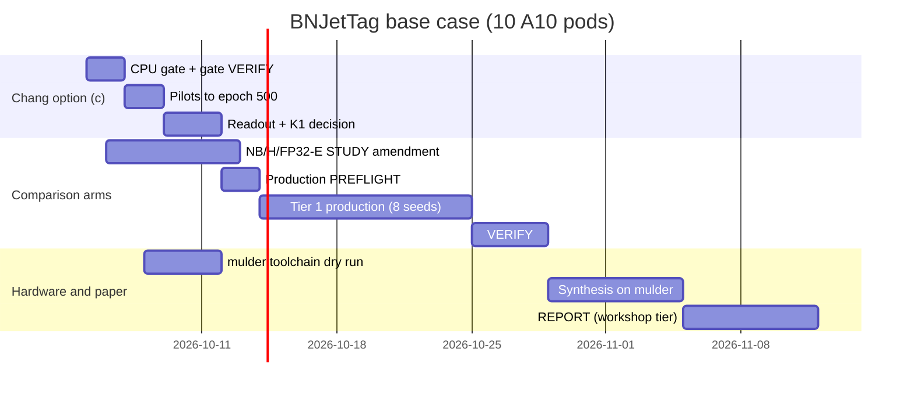

# BNJetTag roadmap: where the project is headed and when a paper is possible

Written 2026-10-05. Sources: three scientist agents (physics-researcher on the literature,
experiment-designer on the schedule, critical-reviewer on the paper threshold) plus the
campaign records. **Nothing on the N=64 line is validated.** Every number below is
single-seed telemetry or a pilot readout, and its status is quoted as written in the source.
Dates are plans, not promises. Revise this file at each decision point.

## 1. The big picture

**Thesis:** a transformer jet tagger with binary `{−1,+1}` weights reaches useful accuracy
at an L1-sized cost and synthesizes for an FPGA with no DSPs at 40 MHz.

**Is it new?** Nobody has published this. The closest work is:

- **Chang/Sun et al. (arXiv:2510.24784).** They use learned bit widths, not binary weights.
- **BitParT (arXiv:2508.07431).** It uses binary weights, but has no hardware results and keeps attention at full precision.
- **PHAT-JeT** (github.com/aaronw5/phat-jet-hw, labelled a NeurIPS 2026 submission). It is an HGQ transformer, not a binary one. It argues that quantization, not architecture, is what limits accuracy, which supports running our study.

The slot is open, but the field is moving fast. Search the literature again before submitting.

**The question that decides everything:** at a matched architecture and a matched 350k EBOP
budget, how far does a binary-weight model (arm **A**) fall behind a learned-width model
(arm **NB**)? Every paper tier below needs the A − NB comparison at 8 paired seeds.

**The obstacle right now:** at 350k EBOPs the binary models collapse.

- Every 350k attention head is exactly uniform.
- A07-350 became a constant classifier.
- The best feasible 350k checkpoint reaches val acc 0.405371 (D-s1; validation, n = 62,000; "diagnostic, unreviewed… not quotable").
- K1 fires, so production is blocked.

Option (c) is the current attempt to fix the controller. Its CPU gate is running now.

## 2. What we are trying to show (question tree)

| # | sub-claim | arm | what we know today (status as written in the source) |
| --- | --- | --- | --- |
| S1 | binary N=64 stays feasible and non-degenerate at 350k EBOPs in ≥6 of 8 seeds | A | A-s2: val acc 0.320871 at 339,168 EBOPs. A-s1 is degenerate. Single seed, "not quotable". |
| S2 | the gap A − NB at the same architecture, recipe and cost | NB | no code and no run yet |
| S3 | where we sit against the released HGQ model | H | xfm N=64 reached 80.56 % test. Single seed, selected on test, "COMPLETE, UNVERIFIED". It cannot be used as a comparison. |
| S4 | the full-precision ceiling | FP32-E | no run |
| S5 | FPGA cost (LUT/FF/DSP) after synthesis | synthesis on mulder | the N=8 R4 attempt failed in the HLS front end; nothing exists for N=64 |
| S6 | latency and II under the 25 ns constraint at 40 MHz | same | none for N=64 |
| (opt.) | levers that raise binary accuracy | Delta | canaries only. Out of the paper's scope unless Tier 1 needs a lever. |

## 3. Timeline (base case)

Assumptions: 10 A10 pods at once (your pod cap; the true schedulable count, G_p, has never
been measured); 0.5 day per review iteration and 2 iterations per phase; each stage starts
as soon as the previous one passes. Arithmetic uses measured A10 speeds (GPU-benchmark
telemetry): 114.10 s/epoch for an E pod at K=4, 96.56 s/epoch for an A07-class pod at K=2.

| stage | what | jobs / compute | dates | gate to pass |
| --- | --- | --- | --- | --- |
| S0 | option (c) CPU gate | `kai-chang1002c-cpugate-691946`, CPU, ≤4 h, **running** | Oct 5–7 | gate VERIFY with exactly 2 known skips; floor re-trace; your §5.2 stop criterion; GPU product |
| S1 | option (c) pilots to epoch 500 | 3 A10 pods: 500 × 114.10 s = 15.9 h; 500 × 96.56 s = 13.4 h; pod 3 about 30.7 h. About 60 GPU-h. | Oct 7–9 | your pilot authorization |
| S2 | readout and K1 decision | CPU readout, ≤4 h, then VERIFY and review | Oct 9–12 | **decision point 1** (§4) |
| S2′ | in parallel: STUDY amendment for NB / H / FP32-E; mulder toolchain dry run | CPU gates; mulder session | Oct 6–13 | panel PASS on the amendment |
| S3 | production PREFLIGHT | new bundle, CPU gate, 110-epoch canaries for the untimed arms | Oct 12–14 | critical-reviewer PASS; lint |
| S4 | **Tier 1 production**: A, NB, FP32-E, H × 8 seeds × 7,000 epochs | E pod: 7,000 × 114.10 s = 221.9 h = 9.2 d. A07 pod: 187.8 h = 7.8 d. 6 E + 4 A07 pods = 2,082 A10 GPU-h | Oct 14 → about Oct 23–25 | ≥6/8 A seeds feasible (S1) |
| S5 | VERIFY | ROC test touched once; paired intervals; review | Oct 26–29 | panel PASS. Your approval moves numbers into the record. |
| S6 | synthesis on mulder | selected A, NB, H checkpoints through csynth (target VU13P at 2.5 ns); Vivado on the xczu7ev proxy | Oct 29 – Nov 5 | needs your MacBook sessions |
| S7 | REPORT, workshop-tier draft | REPORT.md, panel review, prose and figure checks | Nov 5–12 | panel PASS. Nothing goes outward without you. |
| S8 | Tier 2 production: B (budget ladder), C (5M fallback) | 2 E + 4 A07 pods = 1,195 GPU-h, about 9 d | overlaps S5–S7, folds in by about Nov 14 | — |
| — | Delta | 240 runs, 4.5–7.9 d at 10 pods | after Tier 1, only if needed | option (c) adopted → rebase once |

### Scenarios

| scenario | what has to happen | paper-ready draft |
| --- | --- | --- |
| **Optimistic** | option (c) clears K1 with non-uniform attention; 10 pods schedule; reviews pass in 2 rounds | **Nov 12–18** (workshop tier) |
| **Realistic** | 8 pods, one production ITERATE, a slow mulder week | **early December** |
| **Pivot** | 350k arms stay degenerate after (c), so the headline is re-scoped (§4) | **mid-December**, as a matched-cost ladder or characterization paper |

A journal-tier paper adds post-route Vivado on the target part. We hold no VU13P licence
(only the xczu7ev proxy), so the journal tier is **blocked on hardware access**, not compute.

## 4. Decision points

**1. Option (c) readout (about Oct 11–12).**

| outcome | next step |
| --- | --- |
| (i) K1 clears and attention is non-uniform | run production under (c); Delta rebases once (decisions.md, 2026-10-05) |
| (ii) K1 clears but the 350k arms stay degenerate | re-scope the headline to "binary vs NB at matched cost" on a budget ladder where the models work: C/A07 at 5M, an intermediate E target, and NB at the same targets. C-s1 at 5M reached val AUC 0.900360 (single seed, "never quoted"). |
| (iii) K1 still fires | option (d) setpoint scaling, or the 1,000-epoch R recipe at 350k |
| no binary arm is non-degenerate at any budget up to 5M | pivot to a characterization paper: why binary attention collapses under EBOP budgets, plus hardware cost at 5M |

Outcome (ii) is the likely one. In the b5 arms the PID input offset is only 1.5–5.7 % of
headroom, so fixing the controller probably does not fix the collapse.

**2. Production (about Oct 25).** If fewer than 6 of 8 A seeds are feasible, S1 is
unsupported and is reported as k/8 with a binomial interval. That still serves the
characterization paper.

**3. Synthesis (early November).** If the HLS front end fails again, pin the hls4ml version
or split the pragmas, and report csynth estimates only, labelled. If II > 1 at RF=1, report
latency with II and the achieved clock. The 40 MHz condition is II × period ≤ 25 ns.

## 5. When we can write a paper: the threshold

Common to every tier:
- 8 paired seeds per arm, with paired-t 95 % intervals and the count of seeds where the sign holds.
- Selection on validation only; the ROC test set touched once.
- Comparisons at matched N and matched inputs only.
- Cost stated in labelled layers: EBOPs, then csynth estimates, then post-route.
- A gap inside the seed spread is reported as flat.

Rough sensitivity: the only N=64 binary spread on record is 69.0 ± 3.1 % (3 seeds,
archived). With 8 pairs that gives a half-width of about ±0.026, so **gaps under about 3
points will read as flat**.

| tier | venue | must be in hand | distance today |
| --- | --- | --- | --- |
| **W: workshop note** | FastML, NeurIPS ML4PS | K1 cleared (or the claim re-scoped). A and NB at 8 seeds × 7,000 epochs with a reviewed VERIFY (S1, S2). csynth LUT/FF/DSP, II and clock for the seed-median A and NB, labelled as estimates. | **closest.** Blocked by K1, the frozen split and selection rule, the A/NB production and csynth. Base case: mid-November. |
| **N: characterization or negative result** | workshop or MLST | NB at 8 seeds (otherwise the collapse can't be blamed on binary weights). A budget sweep (350k / 500k / 1M / 5M) showing where binary recovers. k/8 collapse counts with attention entropy. Evidence that the PID controller is not the cause. | needs the same NB arm plus Tier 2. Reachable even if (c) fails. |
| **J: journal** | MLST, JINST, or the CMS L1T note route; FPGA venues (FCCM, FPGA, TRETS) need a Pareto win | Tier W, plus H and FP32-E at 8 seeds, post-route Vivado on the target part (WNS, clock), an EBOPs-to-LUT calibration on A and NB, a controller-independence check, and a preprocessing-matched H run | far. Needs a VU13P-class licence or another target part. For an FPGA venue we must beat HGQ's Linformer-64 (79.8 %, 78 ns, 202k LUT, 0 DSP, post-route per `docs/chang-vs-bnjettag.md`) on the Pareto front. |

**Verdict (critical-reviewer): ITERATE.** The nearest reachable paper is Tier W. The A − NB
experiment unblocks both W and N, so it is the single most valuable run in the project.

## 6. Traps that would sink the paper

- **Selection on test.** The replication's 80.56 / 80.85 % were picked on test at seed 42. They can never be a comparison.
- **Comparing across N.** It has happened before: the public results README still compares 10 × 16 against 64 × 3 inputs.
- **Binary may cost more LUT per EBOP.** Session notes from 2026-07-27 (N=10, not verified) record binary layers at about 1.0 LUT per EBOP (2,458,704 LUT for 2,445,357 EBOPs). Chang's models land at 0.13–0.58. The likely cause: distributed arithmetic shares subexpressions between multi-bit weights, but a ±1 weight has nothing to share. If that holds at N=64, matching the EBOP budget does not mean matching LUTs, and the hardware story could flip. The S6 synthesis must measure it directly (`sessions/2026-07-27-bnjettag-training-results-85f6d355.md:74`).
- **Treating EBOPs as hardware.** EBOPs leave out accumulators, which flatters binary. csynth over-estimates LUT by about 2.2–2.5×. Chang's numbers are post-route.
- **Claiming a match to the paper.** Chang's paper gives no per-model EBOPs, PID gains, clock or validation split, and its released code has no PID. A "matched to Chang" claim only means we used the same training target.
- **Preprocessing confound.** Their loader normalizes over train+val, stores float16 and uses seed 42; ours normalizes on train only, uses float32 and split seed 1; the backends differ too. Any H-vs-paper gap can't be attributed without a loader-matched H.
- **Calling it a transformer.** With uniform attention a referee will call it a Deep Set. Report the attention entropy.
- **Parameter count.** Declare which count is used: 6,253 coefficients or 31,735 Keras variables.
- **Timing.** The published N=8 model runs at II=8. At the clock implied by the out-of-context Vivado run, that is about 28.8 ns per jet, which is over the 25 ns budget (reviewer arithmetic on quoted numbers).
- **Conventions disagree.** `docs/conventions` says validation n = 124,000 (80/20) and selection on validation AUC. The N=64 line uses 62,000 (90/10) and validation accuracy. Freeze one before any result exists.

## 7. Decisions only you can make

Each has a recommended default.

1. **The A − NB non-inferiority margin**, fixed before production. Without it, "viable" can only mean "inside the spread". Recommended: 0.01 top-1 (validation-selected, test-reported).
2. **Validation split and selection metric for N=64.** Recommended: keep 62,000 (90/10) and validation accuracy, matching the running campaign, and amend the conventions file.
3. **GPU product for the option (c) pilots.** Recommended: A10, the same product as the regime-B comparison.
4. **The §5.2 stop criterion** in the option (c) PREFLIGHT, written before any pilot result.
5. **Defer Tier 3 arms** (D, F, A07-350, R) with a dated amendment. Recommended: yes.
6. **mulder sessions**, the week of Oct 29, from your MacBook.
7. **Journal tier:** find a VU13P-class licence or pick another target part. This can wait until the workshop draft exists.

## 8. Schedule risks

- A10 saturation ("0/532 nodes"; pods have sat Pending 17–66 min). If only 8 pods schedule, add about 6.5 days.
- Host-memory leaks (caught by the RSS gate). A07 runs out of memory at K=3, so K=2 is the limit on 24 GB cards.
- The retry budget is per pod, and stale heartbeats cost arms their attempts.
- mulder needs your MacBook and UCSD verification; csynth runtime for N=64 is unmeasured.
- Review rounds: the training-batch STUDY took 11 rounds over 3 days.
- The NB, H and FP32-E code is unbuilt and untimed.

Revise this file at each decision point. Point the experiment-log Ops line at it.
