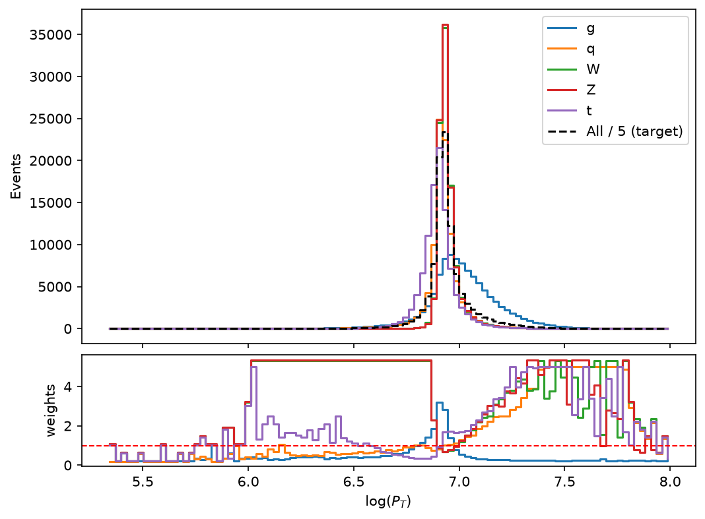
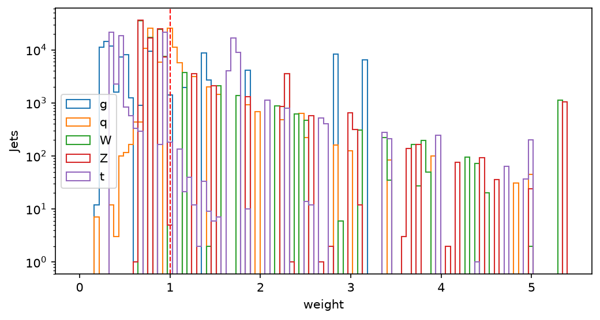
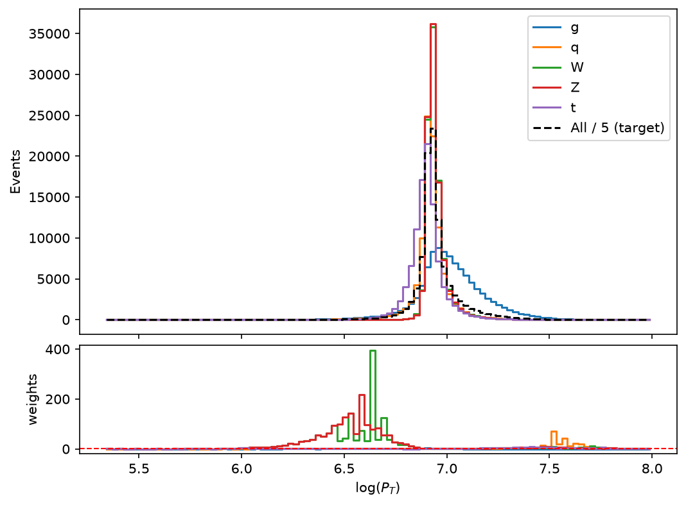
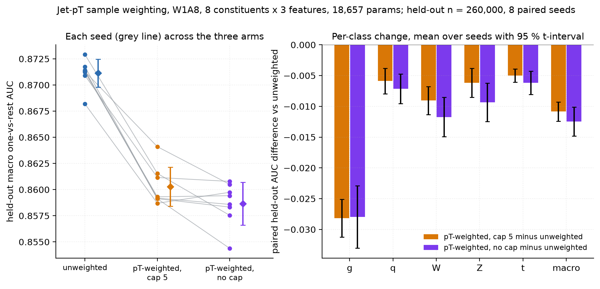
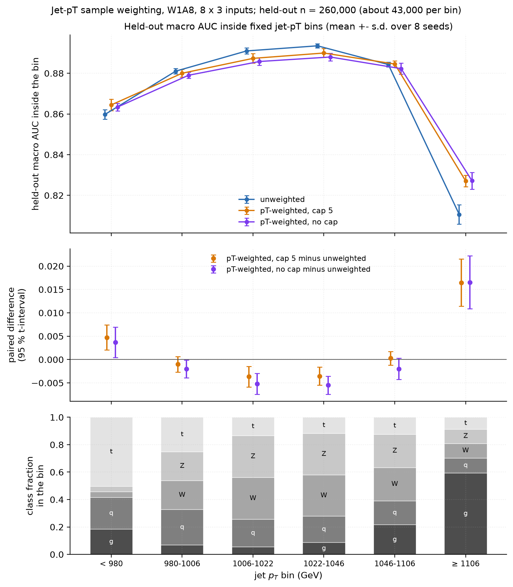

# pt-weighting/

Jet-pT sample weighting for the binary-weight tagger: the method, how its settings were fixed,
the 24-model experiment, and what it shows. This document is the complete write-up; Section 4.5
of the top-level [README](../../../README.md) is its summary.

**Summary.** Each training jet is weighted so that all five classes share one jet-pT shape,
which removes pT as a shortcut for telling the classes apart. On the eight-constituent,
three-feature W1A8 model (18,657 parameters), eight seeds per arm, weighting with a cap of 5
lowers held-out macro AUC by 0.0108 [−0.0124, −0.0093] and top-1 accuracy by 1.54 points
[−1.83, −1.25], in all eight seeds. Inside fixed jet-pT bins it gains in the two tail bins
(+0.47 points below 980 GeV, +1.65 points above 1,106 GeV) and is level or up to 0.37 points
lower in the four central bins, which hold two thirds of the jets. It is not a free improvement;
it trades pT-integrated performance for a response that leans less on pT.

## Contents

1. [Why weight by jet pT](#1-why-weight-by-jet-pt)
2. [The weights](#2-the-weights)
3. [Choosing the bin count and the cap](#3-choosing-the-bin-count-and-the-cap)
4. [The experiment](#4-the-experiment)
5. [Results: pT-integrated](#5-results-pt-integrated)
6. [Results: inside fixed pT bins](#6-results-inside-fixed-pt-bins)
7. [What this establishes, and what it does not](#7-what-this-establishes-and-what-it-does-not)
8. [Reproducing every number](#8-reproducing-every-number)
9. [Files](#9-files)

## 1. Why weight by jet pT

The five classes of the dataset (gluon, light quark, W, Z, top) do not share one jet-pT
distribution. On the held-out split the median jet pT is 1,103 GeV for gluon jets and 991 GeV
for top jets, against 1,013 to 1,025 GeV for the other three classes. Below 980 GeV half of all
jets are top quarks; above 1,106 GeV 60 % are gluons. A network can estimate jet pT from the pT
of its constituents and use it as a class prior. That helps on a test set drawn from the same
spectra, but it gives a response that depends on pT, which shapes any distribution downstream
of the selection and does not carry over to a sample with a different spectrum. Sample
weighting takes that shortcut away without changing the network, its inputs, or its hardware
cost.

## 2. The weights

Each training jet gets a weight that depends on its class c and on the bin b of its log(pT),
in a histogram of 100 equal-width bins spanning the training split:

    w(c, b) = [ (n_all(b) + 0.5) / N_all ] / [ (n_c(b) + 0.5) / N_c ]

n_c(b) is the number of class-c jets in bin b and N_c the class total; n_all and N_all are the
same counts over all five classes. The weight is the combined sample's fraction in the bin
divided by the class's own fraction, so a class is weighted down where it is over-represented
and up where it is rare, and after weighting every class has the pT shape of the combined
sample. The 0.5 keeps sparse bins finite. Two steps follow:

1. **Cap.** Weights above the cap are set to the cap.
2. **Per-class rescaling.** Each class's weights are divided by their mean, so every class
   keeps mean weight one. The class balance and the overall scale of the loss are unchanged.

The histogram is built from each seed's own training split only. The internal validation split,
checkpoint selection on validation AUC, and every evaluation below are unweighted.

For two classes, with one of them taken as the target shape, the rule reduces to weighting the
other class by the ratio of the two class counts in each bin. Applying the inverse ratio
instead, the signal-to-background count ratio to signal jets, emphasizes the bins where signal
is already abundant and moves the two shapes further apart rather than together; the two
choices answer different questions and should not be confused.

Worked values from seed 1's training split (496,000 jets), cap 5:

| Jet | pT bin (GeV) | Class fraction in bin | All-jet fraction in bin | Weight before cap | Final weight |
| --- | --- | --- | --- | --- | --- |
| W | 1,012–1,039 (the W peak) | 35,836 / 99,919 = 35.9 % | 116,947 / 496,000 = 23.6 % | 0.66 | 0.70 |
| W | 1,287–1,322 | 311 / 99,919 = 0.31 % | 4,521 / 496,000 = 0.91 % | 2.92 | 3.10 |
| g | 1,039–1,067 | 8,817 / 99,954 = 8.8 % | 61,113 / 496,000 = 12.3 % | 1.40 | 1.40 |
| g | 1,287–1,322 | 3,263 / 99,954 = 3.3 % | 4,521 / 496,000 = 0.91 % | 0.28 | 0.28 |

The W weights rise by about 6 % between the two columns because the cap lowers the W mean and
the rescaling restores it to one; no gluon weight reaches the cap.



*Figure 1. Top: jets per log(pT) bin for each class on seed 1's training split (496,000 jets,
100 bins), with the combined sample divided by five as the common target shape (dashed). Bottom:
the resulting per-class weight in each bin, cap 5, after the per-class rescaling; the dashed
line marks weight one. Produced by `scan_cap_bins.py`.*



*Figure 2. Number of training jets at each weight, per class, cap 5, seed 1's training split,
logarithmic vertical axis.*

## 3. Choosing the bin count and the cap

The settings were fixed before training from a scan on seed 1's training split, and not tuned
afterwards. For each setting the scan records how well the weighted class shapes agree (the
largest total-variation distance between one class's weighted log(pT) histogram and the mean of
the five, measured on 100 fixed bins: 0 for identical shapes, 1 for disjoint), the effective
sample size (Σw)²/Σw² as a fraction of each class's jets, and the largest weight.

| Bins | Cap | Worst shape distance | Effective sample g / q / W / Z / t | Largest weight |
| --- | --- | --- | --- | --- |
| unweighted | | 0.380 | 1 / 1 / 1 / 1 / 1 | 1 |
| 100 | none | 0.005 | 0.53 / 0.89 / 0.36 / 0.33 / 0.68 | 124.5 |
| 100 | 20 | 0.012 | 0.53 / 0.89 / 0.47 / 0.45 / 0.68 | 20.4 |
| 100 | 10 | 0.023 | 0.53 / 0.89 / 0.58 / 0.58 / 0.68 | 10.4 |
| **100** | **5** | **0.037** | **0.53 / 0.90 / 0.69 / 0.70 / 0.69** | **5.3** |
| 50 | none | 0.076 | 0.54 / 0.88 / 0.35 / 0.31 / 0.70 | 168.5 |
| 50 | 5 | 0.088 | 0.54 / 0.91 / 0.72 / 0.71 / 0.71 | 5.3 |
| 25 | none | 0.131 | 0.58 / 0.88 / 0.36 / 0.31 / 0.76 | 165.2 |
| 25 | 5 | 0.144 | 0.58 / 0.91 / 0.83 / 0.83 / 0.77 | 5.3 |

Uncapped, a few W and Z jets sit in nearly empty bins at the edges of the spectrum and receive
weights above 100, which leaves those classes about a third of their jets' statistical power.
Fewer, wider bins do not cure this, since the extreme weights come from the edges of the
spectrum rather than from bin-to-bin noise, and they flatten the shapes less well. A cap does:
at 100 bins and a cap of 5 the worst shape distance falls from 0.380 to 0.037, a 90 % reduction,
while W and Z keep about 70 % of their effective sample. Gluons stay near 53 % in every setting,
because their spectrum differs from the combined one over its whole range, not only in a sparse
tail. The full grid, including caps of 10 and 20 at every bin count, is in `cap_bins_scan.json`.



*Figure 3. As Figure 1, without a cap. The W and Z weights at the low-pT edge reach the largest
values in the sample.*

## 4. The experiment

The network is the norm-free binary architecture of the top-level README (d = 32, four heads,
two blocks, FFN 64, binary weights, 8-bit activations, standardized inputs), fed with the eight
highest-pT constituents and three features per constituent: pT, and η and φ relative to the jet
axis. It has 18,657 parameters. Three arms were trained:

| Arm | Weights | Array prefix |
| --- | --- | --- |
| Unweighted | none | `BASE` |
| pT-weighted, cap 5 | 100 bins, cap 5 | `PTW5` |
| pT-weighted, no cap | 100 bins, no cap | `PTWNC` |

Apart from their names and the weighting block, the three configurations are identical, which
`configs/gen_ptw.py` asserts when it writes them. The seed fixes both the data split and the
initialization, so the arms are paired seed by seed: eight seeds per arm, 24 models. Training
follows the standard recipe of the top-level README (Adam, learning rate 2 × 10⁻⁵ with one warmup
epoch and linear decay, batch 256, up to 101 epochs, early stopping with patience 15 on
validation macro AUC); each seed's split is 496,000 training and 124,000 internal-validation
jets. Every model is evaluated on the dataset's held-out 260,000-jet split.

## 5. Results: pT-integrated

| Arm (8 seeds) | Held-out macro AUC | Held-out accuracy | Validation accuracy | Rejection at ε_S = 0.5 |
| --- | --- | --- | --- | --- |
| Unweighted | **0.8711 ± 0.0013** | **0.6234 ± 0.0019** | 0.6242 ± 0.0018 | 22.8 ± 0.5 |
| pT-weighted, cap 5 | 0.8603 ± 0.0019 | 0.6080 ± 0.0037 | 0.6083 ± 0.0040 | 20.8 ± 0.7 (91 %) |
| pT-weighted, no cap | 0.8587 ± 0.0020 | 0.6050 ± 0.0038 | 0.6056 ± 0.0035 | 20.3 ± 0.8 (89 %) |

Mean ± sample standard deviation over eight seeds; rejection uses population standard deviation
and the definition of Section 5 of the top-level README, with the percentage of the unweighted
model's rejection retained. Accuracy is top-1 over the five classes. Validation accuracy is
measured on each seed's own internal validation split, rebuilt from the seed and scored with the
stored checkpoint.

| Paired difference against unweighted | Cap 5 | No cap |
| --- | --- | --- |
| Held-out macro AUC | −0.0108 [−0.0124, −0.0093] | −0.0125 [−0.0148, −0.0101] |
| Held-out accuracy | −0.0154 [−0.0183, −0.0125] | −0.0184 [−0.0223, −0.0145] |
| Validation accuracy | −0.0159 [−0.0189, −0.0129] | −0.0185 [−0.0220, −0.0151] |
| AUC, g | −0.0282 [−0.0312, −0.0251] | −0.0280 [−0.0330, −0.0229] |
| AUC, q | −0.0059 [−0.0080, −0.0038] | −0.0072 [−0.0096, −0.0047] |
| AUC, W | −0.0090 [−0.0113, −0.0068] | −0.0117 [−0.0149, −0.0085] |
| AUC, Z | −0.0062 [−0.0085, −0.0038] | −0.0094 [−0.0125, −0.0062] |
| AUC, t | −0.0050 [−0.0061, −0.0039] | −0.0062 [−0.0080, −0.0043] |

Mean over the eight seed pairs with the 95 % t-interval (seven degrees of freedom). The weighted
model is below its unweighted partner in all eight seeds on every row. Gluons lose the most,
2.8 points, as expected from the class whose spectrum is furthest from the combined shape. The
cap is ahead of no cap by 0.0016 in macro AUC, [−0.0002, +0.0034], which does not resolve them,
and by 0.0030 in accuracy, [+0.0008, +0.0052], which does. The best single model by both held-out
AUC and accuracy is unweighted seed 6 (0.8729, 62.60 %); the best weighted model is capped
seed 3 (0.8641, 61.33 %).



*Figure 4 (Figure 6 of the top-level README). Left: held-out macro AUC of every model, each
seed's three models joined by a line; diamonds are the mean and sample standard deviation.
Right: paired per-class AUC difference against the unweighted model, mean with the 95 %
t-interval. Held-out n = 260,000.*

## 6. Results: inside fixed pT bins

A pT-integrated metric on a test set with the training spectra rewards a network for using pT,
so part of the drop above is the removal of exactly what the weighting was meant to remove. The
sharper question is whether weighting costs discriminating power that does not come from pT,
measured by computing AUC only among jets of similar pT. The six bins have fixed edges at the
held-out sextiles of jet pT, rounded to 1 GeV, shared by all 24 models.

| Bin | Jet pT (GeV) | Jets | Unweighted | Cap 5 | No cap | Cap 5 − unweighted | No cap − unweighted |
| --- | --- | --- | --- | --- | --- | --- | --- |
| 1 | below 980 | 43,352 | 0.8597 ± 0.0024 | 0.8644 ± 0.0028 | 0.8634 ± 0.0019 | +0.0047 [+0.0020, +0.0074] | +0.0037 [+0.0004, +0.0069] |
| 2 | 980–1,006 | 43,812 | 0.8810 ± 0.0013 | 0.8800 ± 0.0019 | 0.8790 ± 0.0015 | −0.0010 [−0.0027, +0.0007] | −0.0020 [−0.0039, −0.0001] |
| 3 | 1,006–1,022 | 42,580 | 0.8910 ± 0.0015 | 0.8873 ± 0.0023 | 0.8858 ± 0.0019 | −0.0037 [−0.0059, −0.0015] | −0.0052 [−0.0074, −0.0029] |
| 4 | 1,022–1,046 | 43,929 | 0.8935 ± 0.0010 | 0.8899 ± 0.0022 | 0.8880 ± 0.0019 | −0.0035 [−0.0055, −0.0016] | −0.0055 [−0.0075, −0.0036] |
| 5 | 1,046–1,106 | 43,051 | 0.8843 ± 0.0012 | 0.8845 ± 0.0015 | 0.8823 ± 0.0027 | +0.0003 [−0.0012, +0.0017] | −0.0020 [−0.0043, +0.0003] |
| 6 | 1,106 and above | 43,276 | 0.8106 ± 0.0047 | 0.8271 ± 0.0028 | 0.8272 ± 0.0042 | +0.0165 [+0.0114, +0.0215] | +0.0165 [+0.0109, +0.0222] |
| | mean of the six bins | | 0.8700 ± 0.0014 | 0.8722 ± 0.0016 | 0.8709 ± 0.0016 | +0.0022 [+0.0007, +0.0038] | +0.0009 [−0.0010, +0.0028] |

Macro one-vs-rest AUC over the jets of each bin only, mean ± sample standard deviation over eight
seeds; differences paired by seed, with the 95 % t-interval. This binned analysis and the paired-test
rule (mean difference with its 95 % t-interval and the sign count over seeds) were specified after
the pT-integrated results of Section 5 had been seen, so they are descriptive, not pre-registered
tests; only the arms, the seeds, the bin count and the cap were fixed before training.

The four central bins, 980 to 1,106 GeV, hold two thirds of the jets and are each 16 to 60 GeV
wide, so pT carries little class information inside them. There weighting does not hold
performance: the capped model is level with the unweighted one in two of the four and 0.35 to
0.37 points lower in the other two, and the uncapped model is lower in all four, by 0.20 to 0.55
points. In the two open-ended tail bins the sign reverses: below 980 GeV weighting gains 0.47
points with the cap and 0.37 without it, and above 1,106 GeV it gains 1.65 points in both arms.
The capped model is ahead of its unweighted partner in all eight seeds in both tail bins. These
are the bins that one class dominates, top quarks below and gluons above, and the likely reading
is that the unweighted network's learned pT prior works against it when ranking jets that all
share the same extreme pT. That reading has not been tested directly. The tail bins are also
wide (159 to 980 GeV and 1,106 to 3,157 GeV), so pT still varies inside them.



*Figure 5 (Figure 7 of the top-level README). Top: held-out macro AUC inside each fixed jet-pT
bin, mean and sample standard deviation over eight seeds per arm. Middle: paired difference
against the unweighted model, with the 95 % t-interval. Bottom: class composition of each bin.*

## 7. What this establishes, and what it does not

On this model and dataset, per-class pT weighting costs about one point of macro AUC, 1.5 to 1.8
points of accuracy, 9 to 11 % of the background rejection at ε_S = 0.5, and up to half a point of
AUC at fixed pT in the bulk of the spectrum, while it gains in the tails, where the unweighted
model depends most on pT. Where the two weighted arms differ measurably, the cap of 5 is the
better one. Whether the trade is worth making depends on whether the application needs a
pT-independent response, and none of the metrics above measures that directly. The next
measurement is the pT dependence of the selection efficiency at a fixed working point.

The limits are specific. There is one architecture and one input set and eight seeds per arm.
The held-out set is the dataset's own 260,000-jet split, whose class spectra match training and
so reward pT use by construction. The bin count and cap were fixed from a single-seed scan before
training. Checkpoints were selected on unweighted validation AUC, a criterion that itself favors
pT use. Weighting changes only training, so it has no hardware consequence.

## 8. Reproducing every number

From the repository root. The results tables need only the shipped arrays:

```bash
pip install numpy scikit-learn matplotlib
python3 bnjettag/code/hgq2/sample_weighting/ptw_n8_metrics.py   # rewrites summary.json and roc_auc.md
```

One binned AUC by hand:

```bash
python3 - <<'PY'
import numpy as np
from sklearn.metrics import roc_auc_score
d = np.load("bnjettag/roc-results/ptw-n8/PTW5-s1.npz")    # keys: y, score, j_pt, meta
in_bin = d["j_pt"] >= 1106                                  # bin 6
print(roc_auc_score(d["y"][in_bin], d["score"][in_bin], multi_class="ovr", average="macro"))
PY
```

The weight diagnostics of Sections 2 and 3 and the per-model arrays need the dataset (the
hls4ml 150-particle jet archives, training and held-out splits) and the HGQ2 environment:

```bash
python3 bnjettag/code/hgq2/sample_weighting/scan_cap_bins.py --train-dir <train .h5 dir>
python3 bnjettag/code/hgq2/sample_weighting/eval_ptw_n8.py \
    --ckpt bnjettag/models/ptw-n8 --val-dir <held-out .h5 dir> --train-dir <train .h5 dir>
```

The first rewrites `cap_bins_scan.json` and Figures 1 to 3 in this folder; the second rebuilds
the 24 held-out arrays and the internal-validation arrays from the shipped checkpoints.

## 9. Files

| Path | What it is |
| --- | --- |
| `README.md` | This write-up. |
| `cap_bins_scan.json` | The bin-count and cap scan of Section 3, every setting. |
| `seed1_cap5_13_pt_weights.png`, `seed1_cap5_14_weight_hist.png`, `seed1_nocap_13_pt_weights.png` | Figures 1 to 3. |
| [`../../roc-results/ptw-n8/`](../../roc-results/ptw-n8/) | The 24 held-out arrays (`y`, `score`, `j_pt`), the internal-validation arrays, the claim table `roc_auc.md` with every per-seed number, and `summary.json`. |
| [`../../models/ptw-n8/`](../../models/ptw-n8/) | The 24 trained checkpoints, each with its `input_std.json` and `train_meta.json` (including the per-class weight summary of the run). |
| [`../../code/hgq2/bnhgq2/pt_weights.py`](../../code/hgq2/bnhgq2/pt_weights.py) | The weights: `compute_pt_weights`, the loader `load_train_pt`, and the plotting functions. |
| [`../../code/hgq2/configs/gen_ptw.py`](../../code/hgq2/configs/gen_ptw.py) | Writes the three arm configurations and asserts they differ only in the weighting. |
| [`../../code/hgq2/sample_weighting/`](../../code/hgq2/sample_weighting/) | `scan_cap_bins.py`, `eval_ptw_n8.py` and `ptw_n8_metrics.py`. |
